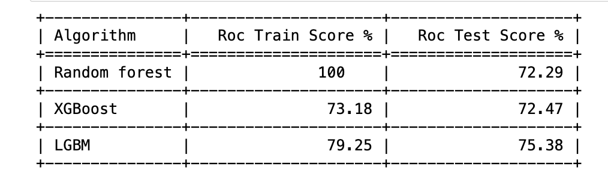
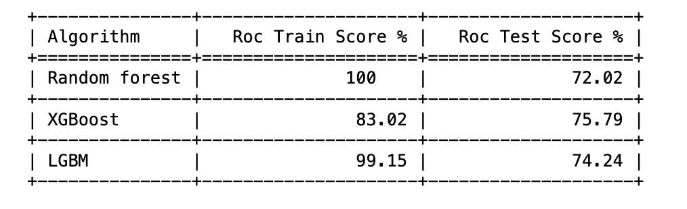
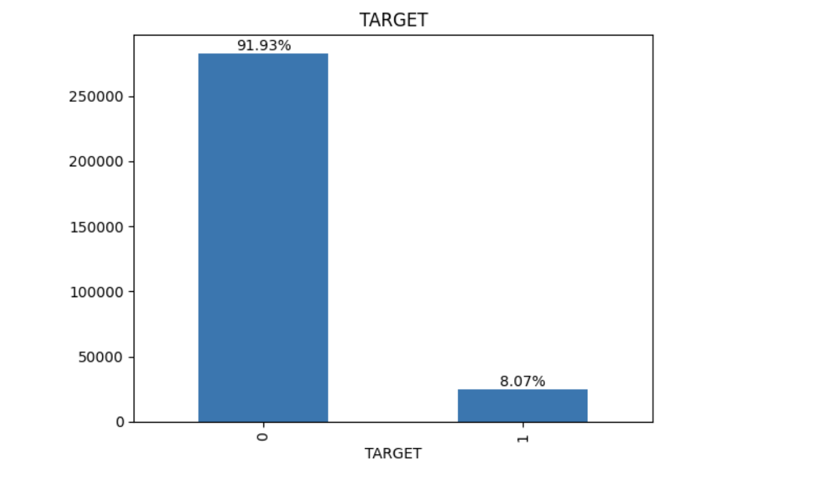
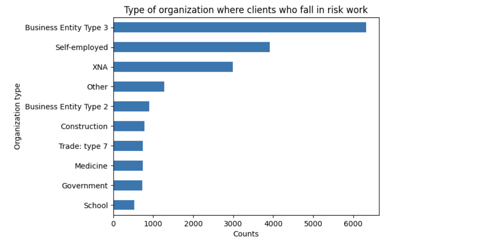
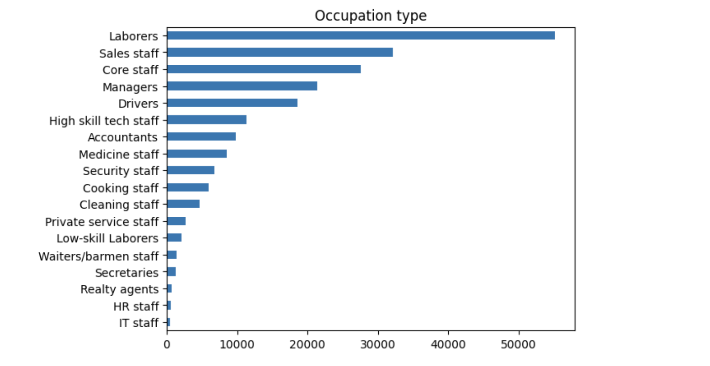
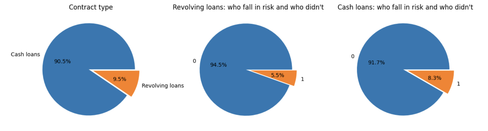
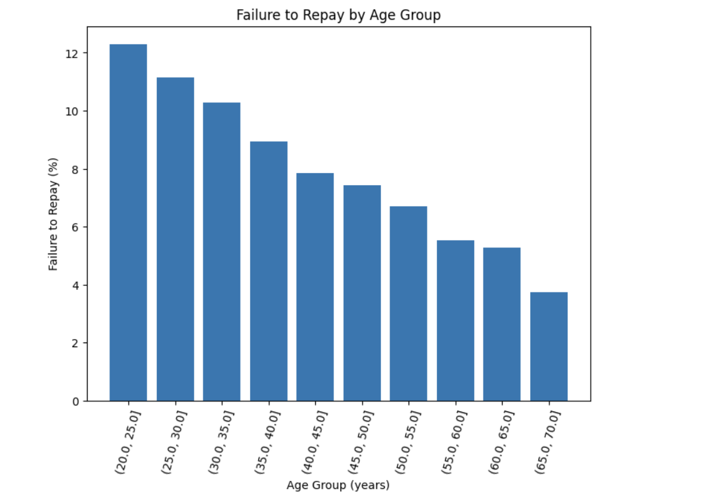

<div align="center">
    <h1>Home Credit Default Risk</h1>
</div>

## Can we predict how capable each applicant is of repaying a loan?

### Introduction
Many people struggle to get loans due to insufficient or non-existent credit histories. And, unfortunately, this population is often taken advantage of by untrustworthy lenders.


### Repository Structure
* **README.md**: The top-level README for reviewers of this project
* **requirements.txt**: requirements file; including the needed tools
* **notebooks**:
    - **01.data_visualization.ipynb**:
    - **02.01.process_main_data.ipynb**:
    - **02.02.bureau_data.ipynb**:
    - **02.03.payment_data.ipynb**:
    - **02.04.cash_data.ipynb**:
    - **02.05.merge_all_datasets.ipynb**:
    - **03.model.ipynb**:
    - **functions.py**:
* **static**:
    - **data**: 
        - **dataProcess**: 
        - **cleanedData**: 
    - **img**:


### Libraries
* pandas
* NumPy
* scikit-learn
* xgboost

### Algorithm
Here is the results of the model when I used only the main dataset:


And here is when I used all the datasets:



## Run the notebooks localy with jupyter
1. Colone this repo
```
git clone https://github.com/khalidsbn/Home-Credit-Default-Risk.git
```
2. Create and activate a virtual environment
```
python3 -m venv .venv
source .venv/bin/activate
```
3. Install the required dependencies (pandas, Numpy, etc)
```
pip install -r requirements.txt
```
4. Open notebooks with jupyter


### Quick look of data exploration

Only around 8% couldn't repay their loan:


Type of organization where clients who fall in risk work:


Occupation type of all clients:


Type of contract loan:


Clients who failure to repay the loan by age group:



### Known issues
Due to the huge size of the datasets, I couldn't upload them. In static/data/process/Data there is a file explaining how to download it after cloning the repo.